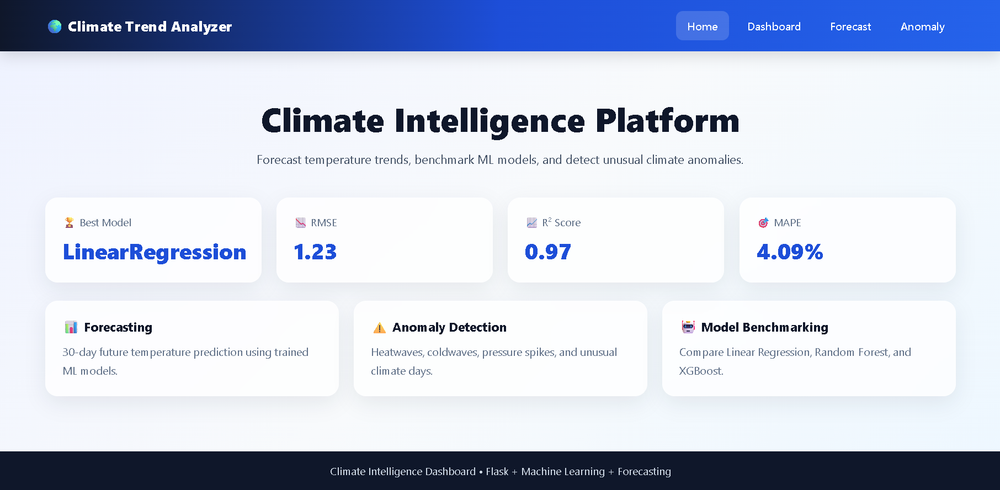
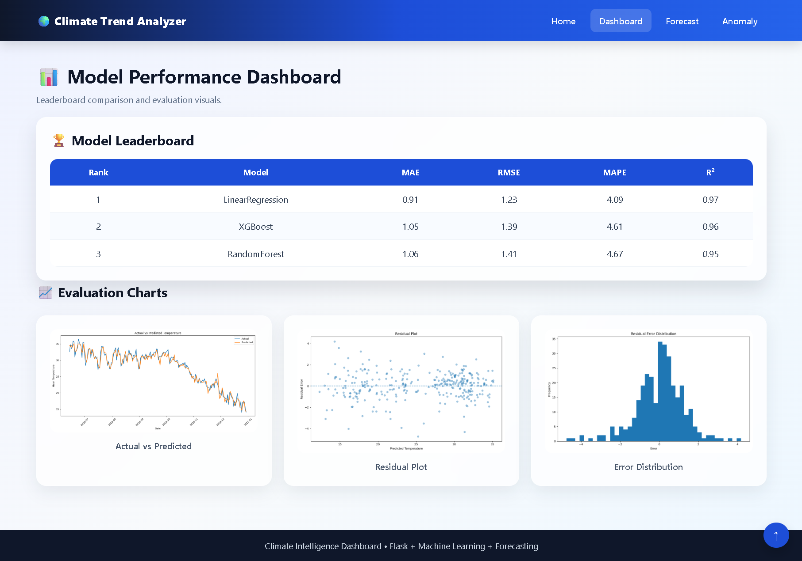
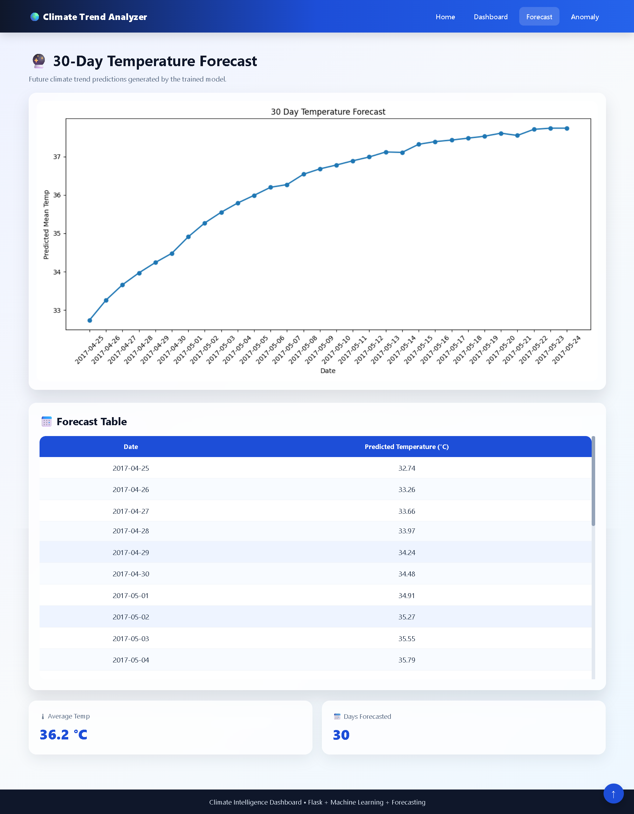
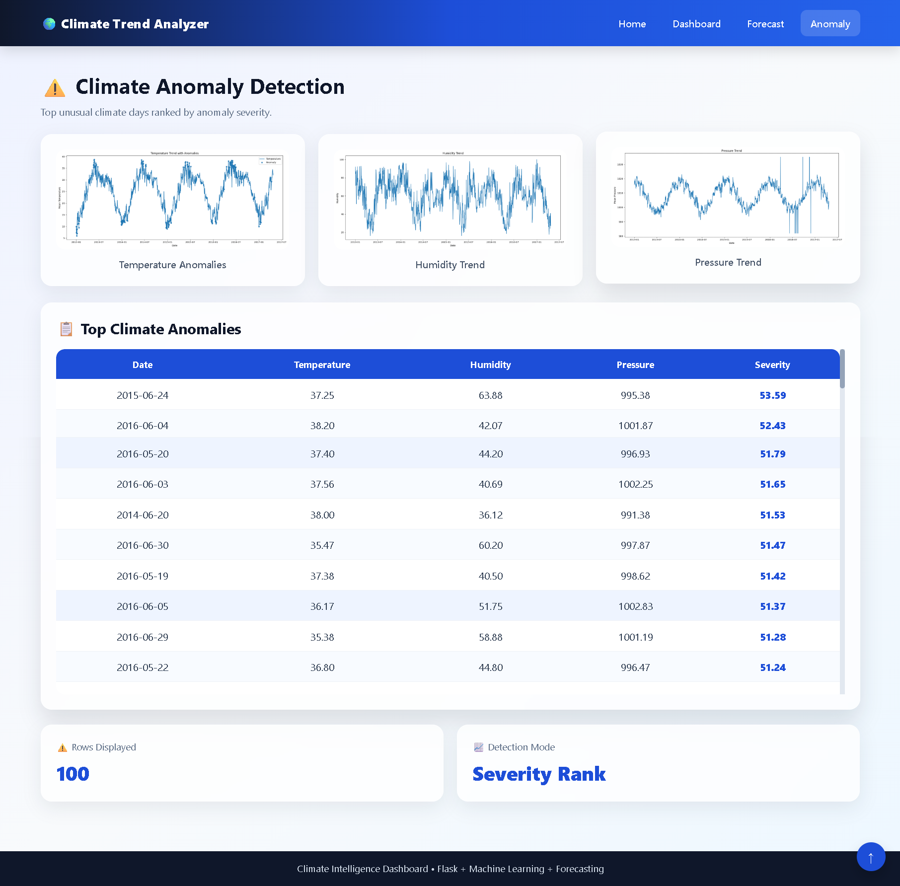

# 🌍 Climate Trend Analyzer Pro – Climate Forecasting & Anomaly Detection Dashboard

<div align="center">


**An end-to-end AI-powered climate analytics system for forecasting future temperatures, detecting anomalies, and visualizing historical climate trends through an interactive web dashboard.**

</div>

---

## 📌 Project Overview

Climate behavior is becoming increasingly unpredictable due to environmental changes, urbanization, and seasonal volatility.

Organizations often struggle with:

- ❌ Inaccurate climate forecasting  
- ❌ Poor preparedness for extreme weather  
- ❌ Lack of anomaly monitoring  
- ❌ Limited data-driven climate insights  

Climate Trend Analyzer Pro solves these challenges through a data science system that:

- 🌡 Forecasts future temperatures  
- ⚠️ Detects unusual climate anomalies  
- 📈 Compares multiple ML models  
- 📊 Visualizes trends through dashboards  
- 🧠 Generates reliable analytical outputs  

---

## 🎯 Problem Statement

Traditional weather and climate planning often relies on static reports or assumptions.

This project replaces manual climate analysis with:

- Predictive temperature forecasting  
- Historical trend analysis  
- Scientific anomaly detection  
- Automated dashboards  
- Data-backed environmental insights  

Resulting in:

- Better planning accuracy  
- Early anomaly awareness  
- Better climate intelligence  
- Improved decision-making  

---

## 🌍 Industry Relevance

Useful for sectors such as:

- Agriculture
- Smart Cities
- Logistics
- Energy Management
- Government Planning
- Environmental Research
- Disaster Preparedness

### Applications:

- Temperature Forecasting
- Weather Trend Monitoring
- Heatwave / Coldwave Alerts
- Climate Analytics
- Smart Planning Systems

---

## 🏗️ System Architecture

```text
Raw CSV Climate Data
        ↓
Data Cleaning & Preprocessing
        ↓
Feature Engineering
        ↓
ML Model Training
        ↓
Best Model Selection
        ↓
Temperature Forecasting
        ↓
Anomaly Detection
        ↓
Flask Dashboard + Reports
````

### Core Modules

* Data Preprocessing
* Feature Engineering
* Model Benchmarking
* Forecasting Engine
* Anomaly Detection
* Flask Dashboard
* Reporting System
* Testing Suite

---

## ⚙️ Tech Stack

| Category         | Tools                 |
| ---------------- | --------------------- |
| Language         | Python                |
| Backend          | Flask                 |
| Machine Learning | Scikit-learn, XGBoost |
| Data Analysis    | Pandas, NumPy         |
| Visualization    | Matplotlib            |
| Frontend         | HTML, CSS, JavaScript |
| Testing          | Pytest                |
| Model Storage    | Joblib                |
| Environment      | Virtual Environment   |

---

## 📁 Project Structure

```text
Climate-Trend-Analyzer/
│
├── app/
│   ├── app.py
│   ├── routes.py
│   ├── static/
│   │   ├── css/
│   │   │   └── style.css
│   │   └── js/
│   │       └── script.js
│   │
│   └── templates/
│       ├── base.html
│       ├── index.html
│       ├── dashboard.html
│       ├── forecast.html
│       └── anomaly.html
│
├── data/
│   ├── raw/
│   └── processed/
│
├── models/
│   └── lr_model.pkl
│
├── outputs/
│
├── screenshots/
│   ├── home_page.png
│   ├── dashboard_page.png
│   ├── forecast_page.png
│   ├── anomaly_page.png
│   └── test_passed.png
│
├── src/
│   ├── main.py
│   ├── config.py
│   ├── preprocess.py
│   ├── feature_engineering.py
│   ├── train_model.py
│   ├── evaluate_model.py
│   ├── forecast.py
│   └── anomaly.py
│
├── tests/
│   ├── test_preprocess.py
│   ├── test_feature_engineering.py
│   ├── test_train_model.py
│   ├── test_forecast.py
│   ├── test_anomaly.py
│   ├── test_flask_routes.py
│   └── conftest.py
│
├── requirements.txt
├── README.md
├── .gitignore
└── LICENSE
```

---

## 📂 Dataset Source

This project uses the **Daily Climate Time Series Data** dataset from Kaggle.

Dataset Link:
[https://www.kaggle.com/datasets/sumanthvrao/daily-climate-time-series-data](https://www.kaggle.com/datasets/sumanthvrao/daily-climate-time-series-data)

Files Used:

* DailyDelhiClimateTrain.csv
* DailyDelhiClimateTest.csv

Place files inside:

```text
data/raw/
```

---

## 🚀 Getting Started

## 1️⃣ Clone Repository

```bash
git clone https://github.com/yourusername/Climate-Trend-Analyzer-Pro.git
cd Climate-Trend-Analyzer-Pro
```

---

## 2️⃣ Create Virtual Environment

### Windows

```bash
python -m venv venv
venv\Scripts\activate
```

### Mac/Linux

```bash
python3 -m venv venv
source venv/bin/activate
```

---

## 3️⃣ Install Dependencies

```bash
python.exe -m pip install --upgrade pip
pip install -r requirements.txt
```

---

## 4️⃣ Run ML Pipeline

```bash
python src/main.py
```

---

## 5️⃣ Run Web Dashboard

```bash
python app/app.py
```

Open browser:

```text
http://127.0.0.1:5000/
```

---

## 📊 Dataset Features

Includes:

* Daily temperature values
* Humidity levels
* Wind speed
* Atmospheric pressure
* Date-wise climate patterns
* Seasonal trends

---

## 🤖 Modeling Approach

Uses multiple models:

* Linear Regression
* Random Forest Regressor
* XGBoost Regressor

### Best Model Auto Selected Using:

* RMSE
* MAE
* MAPE
* R² Score

### Final Winner:

✅ Linear Regression

---

## 🔮 Forecasting Logic

Predicts the next **30 days** future temperature trend using trained model and engineered lag features.

### Output Includes:

* Future Forecast CSV
* Forecast Chart
* Average Predicted Temperature

---

## ⚠️ Anomaly Detection Logic

Detects unusual climate conditions such as:

* Heatwaves
* Coldwaves
* Pressure spikes
* Humidity abnormalities

Uses severity ranking system.

---

## 📈 Outputs

Generated inside `/outputs`

* future_forecast.csv
* climate_anomalies.csv
* leaderboard.csv
* metrics.json
* Forecast charts
* Evaluation charts

---

## 🖼️ Dashboard Screenshots

### Home Dashboard



### Model Dashboard



### Forecast Page



### Anomaly Page



### Testing Results


---

## 🧪 Testing

Run tests:

```bash
pytest
```

Run tests for detailed information:

```bash
pytest -v
```


Coverage:

```bash
pytest --cov=.
```

### Result:

```text
36 Passed
```

---

## 🎓 Learning Outcomes

* End-to-end ML project development
* Time series forecasting concepts
* Feature engineering for climate data
* Model benchmarking techniques
* Flask web deployment
* Testing automation
* Portfolio-grade software structuring

---

## 🚀 Future Improvements

* Live Weather API Integration
* LSTM / Deep Learning Forecasting
* Region-wise climate forecasting
* PDF automated reports
* Cloud deployment (AWS / Render)
* Real-time alerts system

---

## 👤 Author

**Girish Shenoy**

AI-Driven Data & Business Analyst | Forecasting, Fraud & Revenue Optimization | Business & Decision Intelligence

---

## ⭐ Support

If you found this project useful, consider giving it a ⭐ on GitHub.